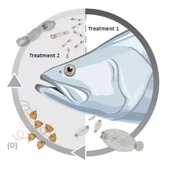

{width="170" height="47"}

In this notebook I used the data Life cycle for *Seriola* monogeneans compiled by Kate H and saved [in the SharePoint project folder](https://cawthron99.sharepoint.com/:x:/s/BeNeZe/EWgO16cI_2FBiKgpk7theAAB5N9wtZatuPdfeRUgSLqkzw?email=Javier.Atalah%40cawthron.org.nz&e=tytqog). Records obtained at salinities \<20 (i.e. brackish water) were not considered in the analyses. Similarly records when no hatching was observed or estimated to be larger than (e.g.\>52.1 days) were omitted.

```{r setup, include=FALSE}
knitr::opts_chunk$set(echo = TRUE, warning = F, fig.dim = c(9, 3), fig.align = 'center')
```

```{r}
options(tidyverse.quiet = TRUE)
library(readxl)
library(tidyverse)
library(DT)
library(knitr)
library(broom)

mono <- read_excel('data/Life cycle data for Seriola monogeneans_JA.xlsx')
theme_set(theme_bw())

mono %>% 
  group_by(species) %>% 
  summarise_if(is.numeric, mean,  na.rm = T) %>% 
  kable(digits = 1, caption = 'Summary of data for the life cycle of Seriola monogeneans used in the analysis')

```

## Regression models

The best fit for the models was obtained using a using a power regression. Curves were fitted using the formula ***y = y~0~ • t^b^*** , where **y** is the number of days for each species to first, last hatching or sexual maturitity at a water temperature ***t*** in °C, ***y***~**0**~ is the number of days to first, last hatching or maturity at a water temperature of 0 °C, and ***b*** is a constant describing how quickly ***y*** decreases with temperature.

### Relationship between temperature and time to first hatch

```{r}
mono %>%
  ggplot(aes(temp, time_1st_hatch, color = species)) +
  geom_point() +
  stat_smooth(
    method = 'nls',
    formula = 'y~a*x^b',
    method.args = list(start = c(a = 40, b = -1)),
    se = FALSE
  ) +
  facet_wrap(~species) +
  scale_color_discrete(guide = F) +
  labs(x = "Temperature (°C)", y = "Time to first hatch (days)")
```

There is very poor fit for the *Neobenedenia girellae* regression.

### Relationship between temperature and time to last hatch

```{r}
mono %>%
  ggplot(aes(temp, time_last_hatch, color = species)) +
  geom_point() +
  stat_smooth(
    method = 'nls',
    formula = 'y~a*x^b',
    method.args = list(start = c(a = 40, b = -1)),
    se = FALSE
  ) +
  facet_wrap(~species) +
  scale_color_discrete(guide = F) +
  labs(x = "Temperature (°C)", y = "Time to last hatch (days)")

```

Ditto as above very poor fit for *Neobenedenia girellae* .

### Relationship between temperature and time to sexual maturity

```{r}
mono %>%
  ggplot(aes(temp, time_maturity, color = species)) +
  geom_point() +
  stat_smooth(
    method = 'nls',
    formula = 'y~a*x^b',
    method.args = list(start = c(a = 40, b = -1)),
    se = FALSE
  ) +
  facet_wrap(~species) +
  scale_color_discrete(guide = F) +
  labs(x = "Temperature (°C)", y = "Time to sexual maturity (days)")
```

## Model summaries

```{r, message= F}
# Fit models---
mono_nested <-
  mono %>%
  group_by(species) %>%
  nest()


new_data <- tibble(temp = seq(10, 35))


# Last hatch models---
first_hatch_models <- 
  mono_nested %>%
  mutate(
    nls_models = map(
      .x = data,
      ~ nls(time_1st_hatch   ~ a * temp ^ b ,
            start = list(a = 40, b = -1),
            control = list(maxiter = 500),
            trace = F,
            data = .x
      )),
    nls_summary = map(.x = nls_models, tidy),
    first_hatch = map(.x = nls_models, ~predict(.x, newdata = new_data))
  )

first_hatch_models %>% 
  select(nls_summary) %>% 
  unnest(nls_summary) %>% 
  kable(digits = 2, caption = "First to hatch model summaries for each species")

# Last hatch models---
last_hatch_models <- 
  mono_nested %>%
  mutate(
    nls_models = map(
      .x = data,
      ~ nls(time_last_hatch   ~ a * temp ^ b ,
            start = list(a = 40, b = -1),
            control = list(maxiter = 500),
            trace = F,
            data = .x
      )),
    nls_summary = map(.x = nls_models, tidy),
    last_hatch = map(.x = nls_models, ~predict(.x, newdata = new_data))
  )

last_hatch_models %>% 
  select(nls_summary) %>% 
  unnest(nls_summary) %>% 
  kable(digits = 2, caption = "Last to hatch model summaries for each species")


# maturity models
mat_models <- 
  mono_nested %>%
  mutate(
    nls_models = map(
      .x = data,
      ~ nls(time_maturity   ~ a * temp ^ b ,
            start = list(a = 50, b = -.01),
            control = list(maxiter = 500),
            trace = F,
            data = .x
      )),
    nls_summary = map(.x = nls_models, tidy),
    time_maturity = map(.x = nls_models, ~predict(.x, newdata = new_data))
  )

mat_models %>% 
  ungroup() %>%
  select(nls_summary) %>% 
  unnest(nls_summary) %>% 
  kable(digits = 2, caption = "Time to sexual maturity model summaries for each species")
```

The *Neobenedenia girellae* models for time to first and last hatch are non-significant. I use all the other models to predict the time to first and last hatch, and sexual maturity for each species for water temperatures between 10 and 35. Time to first and last hatch for *Neobenedenia girellae* is estimated using the overall mean time.

The lower and upper limits of treatment times are then calcualted using:

-   lower_treat = last_hatch + 1

-   upper_treat = (first_hatch + time_maturity) - 1

```{r, message=F}
pred_dat <- 
  mat_models %>% 
  select(time_maturity) %>% 
  unnest(cols = c(time_maturity) ) %>% 
  ungroup() %>% 
  bind_cols(
  first_hatch_models %>% 
  select(first_hatch) %>% 
  unnest(cols = c(first_hatch)) %>% 
  ungroup()) %>% 
  bind_cols(
    last_hatch_models %>% 
      select(last_hatch) %>% 
      unnest(cols = c(last_hatch)) %>% 
      ungroup()) %>% 
  bind_cols(temp = rep(seq(10,35),3)) %>% 
  select(-species1, -species2, species, temp ) %>% 
  mutate(lower_treat = last_hatch   + 1,
         upper_treat = (first_hatch    + time_maturity) - 1)


# replace last hatch time for neobedenia with the mean ---
pred_data <- 
  pred_dat %>% 
  mutate(last_hatch   = if_else(species == "Neobenedenia girellae", 6.6, last_hatch))
write_csv(pred_data, 'data/pred_data.csv')


datatable(pred_data, filter = 'top') %>% formatRound(2:7,1)

```

This data table with the predicted reproductive parameters for each of the three monogeneans species was used to build a beta version of the [BeNeZe Shiny app](https://cawthron.shinyapps.io/BeNeZe_app_v2/).

{width="456"}
